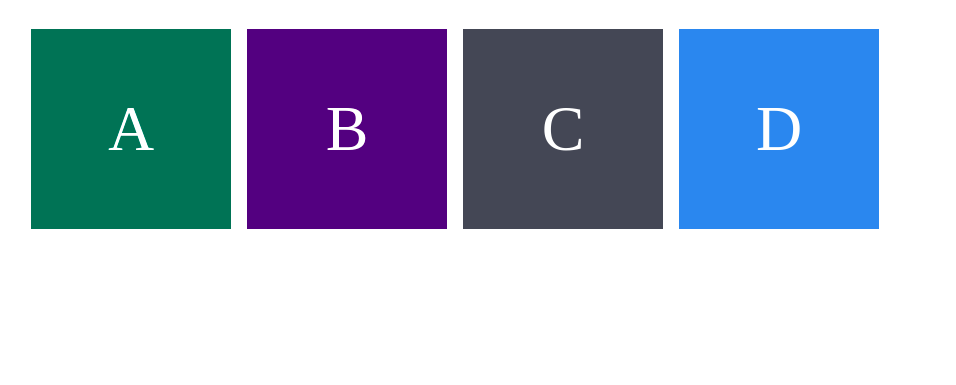
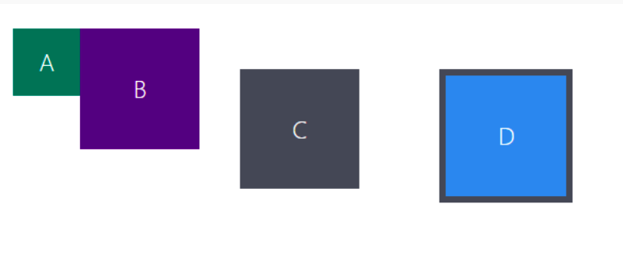
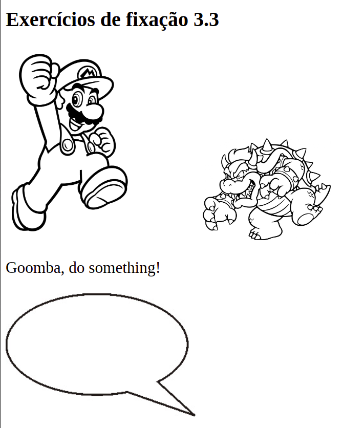
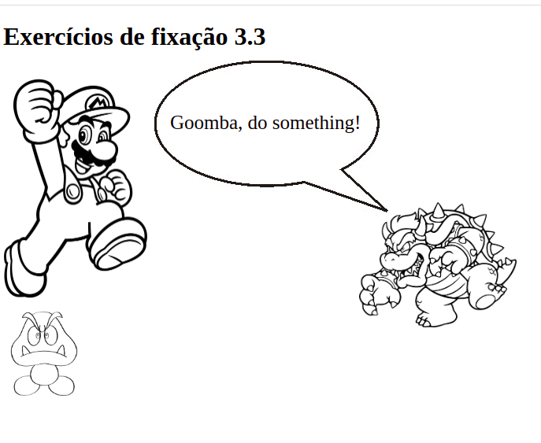

## 3.3 - HTML & CSS - Seletores e posicionamento
Na aula de hoje do curso da Trybe, aprendemos sobre os seletores de posicionamento no CSS, como combinar e agrupar os seletores da melhor forma possível,
e também sobre o conceito de "box model", que ensina como os elementos html se relacionam visualmente e como posicionar cada elemento.

**Foram realizados diversos exercícios hoje, os arquivos de cada um estão em pastas separadas, aqui vou descrever os requisitos de cada um e o resultado final esperado:**

#### Exercício 1 - Box Model
  * Situação inicial:

  </img>
  

  
  * Resultado Esperado:

  </img>

#### Exercício 2 - Posicionamento de Elementos

 * Situação inicial:

  </img>
 
  
  * Resultado Esperado:
 
  </img>
  
  #### Exercício 3 - Agrupamento de Seletores e Pseudoclasses em CSS
  * Exercícios Realizados:
1. Adicione uma lista ordenada dos 3 melhores sites que você conhece.
2. Crie um arquivo no mesmo diretório e nomeie-o de 'style.css'.
3. Nesse arquivo .css, adicione os estilos para que:
   - O texto das tags 'h1' e 'p' estejam centralizados.
   - A cor de fundo da sua lista mude quando o cursor estiver sobre o item.
   - A fonte do item mude quando ele for clicado.
4. Adicione uma lista não ordenada com, pelo menos, 3 características que você gosta.
5. No 'style.css', adicione a propriedade 'list-style: none' para ambas as listas.

  #### Exercício 4 - Agrupamento de Seletores e Pseudoclasses em CSS
  * Para o próximo exercício, não foi atribuido nenhuma classe ou id aos componentes, apenas utilizado pseudoclasses para individualizar cada elemento!
  * Exercícios Realizados:
1. Estilize as divs para que, ao passar o cursor por cima das mesmas, elas ganhem uma borda.
2. Faça cada div ter uma cor própria.
3. Estilize cada uma das tags h3.
4. Faça a terceira div ser maior que as demais.
5. Deixe as tags ímpares h3 com o texto em itálico.

  #### Exercício 5 - Combinações e classes descendentes
  * Crie o arquivo style.css e resolva os seguintes exercícios:
1. Faça com que todos os itens de Listas Ordenadas tenham uma cor de fundo amarela. Se a numeração do item for PAR, faça a cor de fonte ser verde. Se o número for considerado ÍMPAR, utilize a propriedade text-transform para deixar o texto maiúsculo.
2. Faça todas as tags Header (h1, h2...) possuírem cor de fonte vermelha e, se alguma delas estiver em itálico, aumente seu tamanho para 40px e acrescente uma borda de 1px preta e sólida.
3. Faça todas as li's terem 20px de tamanho de fonte e, para todo texto em itálico dentro de alguma li, utilize a propriedade font-weight para deixá-lo negrito.
4. Na listagem de linguagens de programação, faça com que as 3 primeiras da lista possuam cor de fonte azul e, se alguma possuir "java*" no texto, utilize uma cor de fundo rosa.
5. (Bônus) Para cada link na lista de aliados da pessoa desenvolvedora, faça com que ao passar o mouse sobre cada um, o texto fique em negrito e assuma a cor de fonte "temática do site"
