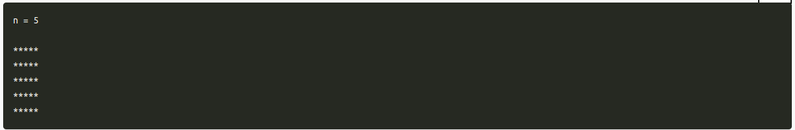
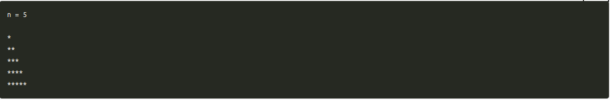
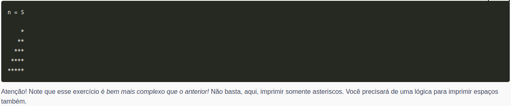
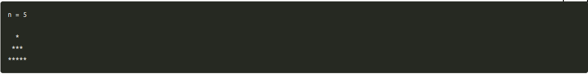
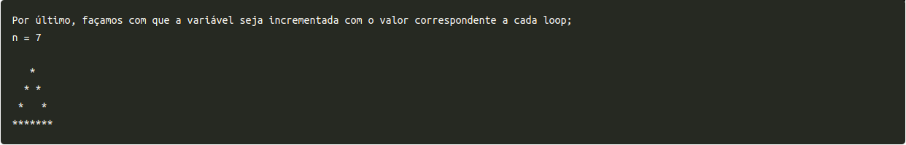

# DIA 4.3 - Exercícios Bônus

Exercícios bônus realizados no terceiro dia do bloco 4 da Trybe (Lógica de programação e algoritimos);

1. Agora vamos trabalhar com algumas formas geométricas! Faça um programa que, dado um valor n qualquer, seja n > 1, imprima na tela um quadrado feito de asteriscos de lado de tamanho n. Por exemplo:

2. Para o segundo exercício, faça o mesmo que antes, mas que imprima um triângulo retângulo com 5 asteriscos de base. Por exemplo:

3. Agora inverta o lado do triângulo. Por exemplo:

4. Depois, faça uma pirâmide com n asteriscos de base:

5. Faça uma pirâmide com n asteriscos de base que seja vazia no meio. Assuma que o valor de n será sempre ímpar:

6. Faça um programa que diz se um número definido numa variável é primo ou não. 

  * Um número primo é um número que só é divisível por 1 e por ele mesmo, ou seja, a divisão dele com quaisquer outros números dá resto diferente de zero;
  * Dica: você vai precisar de fazer um loop que vá de 0 ao número definido; Além disso, vai precisar de fazer uma checagem a cada iteração e armazenar os resultados em algum lugar;
