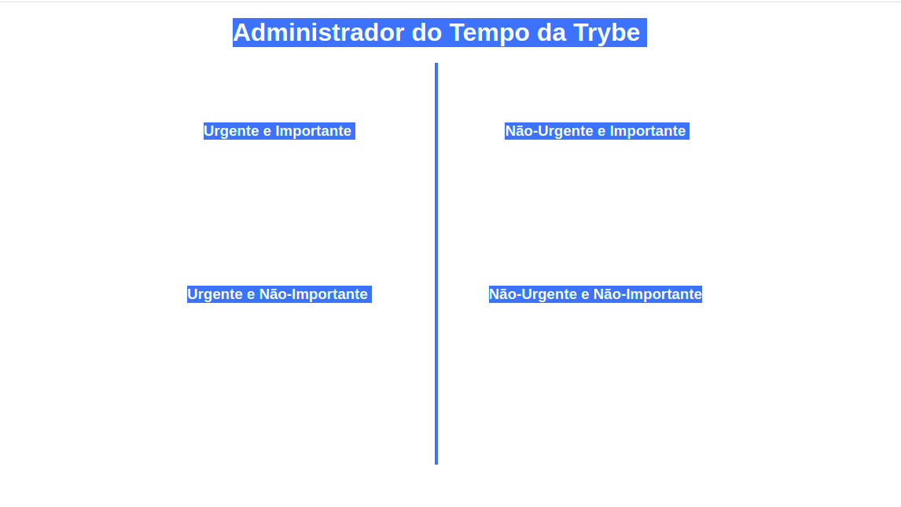
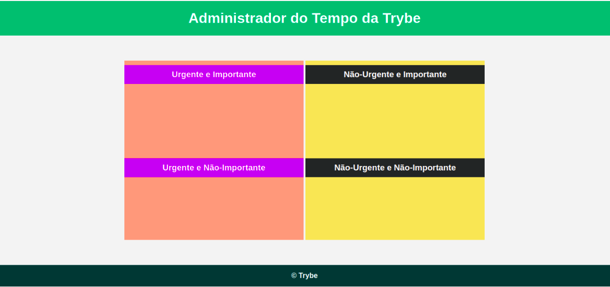

# Exercícios dia 5.1 - JavaScript - DOM e seletores
Neste dia no curso da trybe aprendemos sobre o DOM e seus diversos tipos seletores, e como podemos manipular os elementos html utilizando o DOM e o JavaScript.  
**O primeiro exercício realizado tinha como desafio á seguinte página:**

</img>

<b>O objetivo era utilizar os seletores DOM através do JavaScript para chegar no seguinte resultado:</b>

</img>

