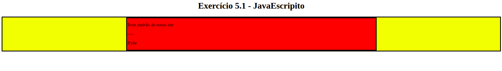
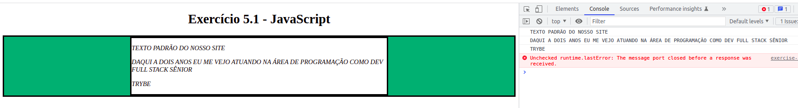

# Exercícios dia 5.1 - JavaScript - DOM e seletores
Neste dia no curso da trybe aprendemos sobre o DOM e seus diversos tipos seletores, e como podemos manipular os elementos html utilizando o DOM e o JavaScript.  
**O segundo exercício realizado tinha como desafio os seguintes requisitos a serem cumpridas:**
* Modificar os elementos já existentes utilizando apenas as funções:
    - document.getElementById();
    - document.getElementsByClassName();
    - document.getElementsByTagName();
1. Crie uma função que mude o texto na tag <"p">-----<"/p"> para uma descrição de como você se vê daqui a 2 anos.
2. Crie uma função que mude a cor do quadrado amarelo para o verde da Trybe (rgb(76,164,109)).
3. Crie uma função que mude a cor do quadrado vermelho para branco.
4. Crie uma função que corrija o texto da tag <"h1">.
5. Crie uma função que modifique todo o texto da tag <"p"> para maiúsculo.
6. Crie uma função que exiba o conteúdo de todas as tags <"p"> no console.
### Pagina Inicial do exercício antes do cumprimento dos requisitos:

</img>

### Resultado final após o cumprimento dos requisitos:

</img>

